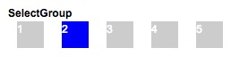

# SelectGroup
用于一组单选元素，可选中单个元素并定义选中样式，每个元素的内容可自定义

## 基本使用
配合select-item进行使用，item内元素可填充任何内容，其可携带任何值

```
<x-select-group 
  @select-change="handleSelectChange" 
  :default-select="curSelect"
  class="select-group">
  <x-select-item v-for="item of selectList"
    :key="item"
    :value="item"
    class="select-item">
    {{item}}
  </x-select-item>
</x-select-group>
```

## 预览


## props
### selectGroup
prop | value | default| 描述
---  |  ---  |   ---  | ---
defaultSelect | - | firstItem | 默认选中的元素

### selectItem
prop | value | default| 描述
---  |  ---  |   ---  | ---
value | - | - | 每个元素包含的值

## events
### @select-change
当更改选中时触发，会传入选中元素的value值