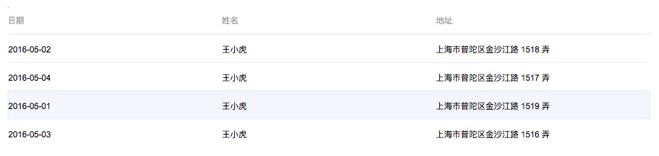
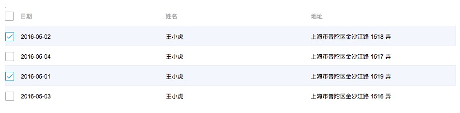

# Table

按钮组件, 各类样式可以持续添加

## 基本使用



``` html
<template>
  <x-table
    :columns="columns" 
    :data="tableData">
  </x-table>
</template>
<script>
export default {
  data () {
    return {
      columns: [{
        title: '日期',
        key: 'date'
      }, {
        title: '姓名',
        key: 'name'
      }, {
        title: '地址',
        key: 'address'
      }],
      tableData: [{
        date: '2016-05-02',
        name: '王小虎',
        address: '上海市普陀区金沙江路 1518 弄'
      }, {
        date: '2016-05-04',
        name: '王小虎',
        address: '上海市普陀区金沙江路 1517 弄'
      }, {
        date: '2016-05-01',
        name: '王小虎',
        address: '上海市普陀区金沙江路 1519 弄'
      }, {
        date: '2016-05-03',
        name: '王小虎',
        address: '上海市普陀区金沙江路 1516 弄'
      }]
    }
  }
}
</script>
```

### 带选项的table


增加type="select"

```
<x-table
  :columns="columns"
  type="select"
  @select-change="handleSelectChange"
  :data="tableData">
</x-table>
```

### 可排序table
columns中增加sortable: true

注意，我们不会直接对节点进行排序，而是在sort-change事件中，返回排序的key和顺序

同时在表格中标记顺序，（图标还没加）

```
<x-table
  :columns="columns"
  type="select"
  @select-change="handleSelectChange"
  @sort-change="handleSortChange"
  :data="tableData">
</x-table>
```

```
columns: [{
  title: '年龄',
  key: 'age',
  sortable: true
}]
```

### 自定义内容
可使用render函数自定义个元素的内容

```
<script>
export default {
  data () {
    return {
      columns: [{
        title: '日期',
        key: 'date',
        render (h, params) {
          return <span>日期：{dateFormat(params.row.date)}</span>
        }
      }, {
        title: '姓名',
        key: 'name'
      }, {
        title: '地址',
        key: 'address'
      }],
      tableData: [{
        date: '2016-05-02',
        name: '王小虎',
        address: '上海市普陀区金沙江路 1518 弄'
      }, {
        date: '2016-05-04',
        name: '王小虎',
        address: '上海市普陀区金沙江路 1517 弄'
      }, {
        date: '2016-05-01',
        name: '王小虎',
        address: '上海市普陀区金沙江路 1519 弄'
      }, {
        date: '2016-05-03',
        name: '王小虎',
        address: '上海市普陀区金沙江路 1516 弄'
      }]
    }
  }
}
</script>
```


