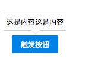

# Popover

弹出框，可以控制上下左右四个方向

## 基本使用
分为两个元素，trigger: 触发弹出框的元素，content: 弹出框内容
用slot实现

``` html
<x-popover class="popover">
  <x-button type="primary" slot="trigger">触发按钮</x-button>
  <span slot="content">
    这是内容这是内容
  </span>
</x-popover>
```



### 不同位置
posistion 控制不同显示位置

``` html
<x-popover class="popover">
  <x-button type="primary" slot="trigger">top</x-button>
  <span slot="content">
    这是内容这是内容
  </span>
</x-popover>
<x-popover class="popover" position="right">
  <x-button type="primary" slot="trigger">right</x-button>
  <span slot="content">
    这是内容这是内容
  </span>
</x-popover>
<x-popover class="popover" position="left">
  <x-button type="primary" slot="trigger">left</x-button>
  <span slot="content">
    这是内容这是内容
  </span>
</x-popover>
<x-popover class="popover" position="bottom">
  <x-button type="primary" slot="trigger">bottom</x-button>
  <span slot="content">
    这是内容这是内容
  </span>
</x-popover>
```

### 定制箭头大小
```
<x-popover class="popover" :arrow-width="5" position="right">
  <x-button type="primary" slot="trigger">right</x-button>
  <span slot="content">
    这是内容这是内容
  </span>
</x-popover>
```

### 定制内容样式
```
<x-popover class="popover" :over-style="{
  lineHeight: '200px',
  width: '200px',
  textAlign: 'center'
}" position="bottom">
  <x-button type="primary" slot="trigger">bottom</x-button>
  <span slot="content">
    这是内容这是内容
  </span>
</x-popover>
```

### 触发效果
默认hover触发，可以设置为点击触发

```
<x-popover class="popover" trigger="click">
  <x-button type="primary" slot="trigger">left click</x-button>
  <span slot="content">
    这是内容这是内容
  </span>
</x-popover>
```

## props

prop | value | default| 描述
---  |  ---  |   ---  | ---
position | top\left\right\bottom | top | 内容展现位置
trigger | hover\click | hover | 触发内容展现方式
arrowWidth | Number | 8 | 箭头宽度
overStyle | Object | null | 自定义内容样式

