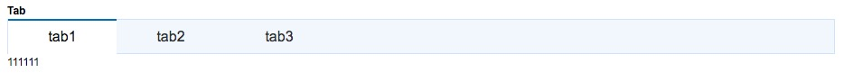

# Tab
选项卡组件

## 基本使用
配合tabPanel使用

``` html
<x-tab @select-change="handleSelectChange">
  <x-tab-panel title="tab1" name="1">111111</x-tab-panel>
  <x-tab-panel title="tab2" name="2">222222</x-tab-panel>
  <x-tab-panel title="tab3" name="3">333333</x-tab-panel>
</x-tab>
```

## 预览


## props

prop | value | default| 描述
---  |  ---  |   ---  | ---
title | String | - | 选项卡标题
name | String | - | 选项卡对应的标识符

## events
### select-change
选项卡切换事件，会传入每个选项卡对应的标识符