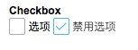

# Checkbox

多选框

## 基本使用

``` html
<x-checkbox v-model="value">选项</x-checkbox>
<x-checkbox disabled v-model="value">禁用选项</x-checkbox>
```

## CheckboxGroup
多选组, 用于一组多选框的选择

```
<x-checkbox-group v-model="value" @change="handleSelectChange">
  <x-checkbox value="1">选项1</x-checkbox>
  <x-checkbox value="2">选项2</x-checkbox>
</x-checkbox-group>
```

## 预览


## props

prop | value | default| 描述
---  |  ---  |   ---  | ---
v-model | - | - | 双向数据绑定的属性
checked | Boolean | false | 不设置v-model的时候，可以用这个代替
disabled | true/false | false | 是否禁用
value | any | - | 用于多选的选中值


